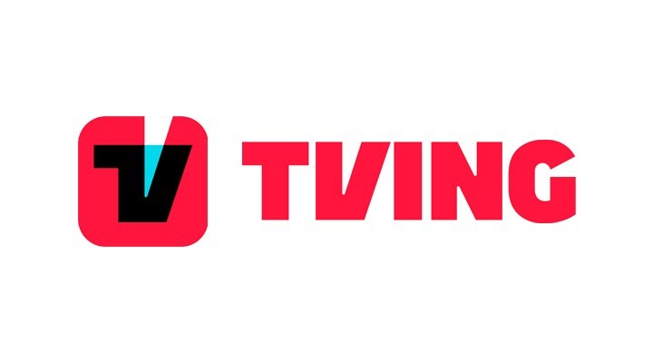
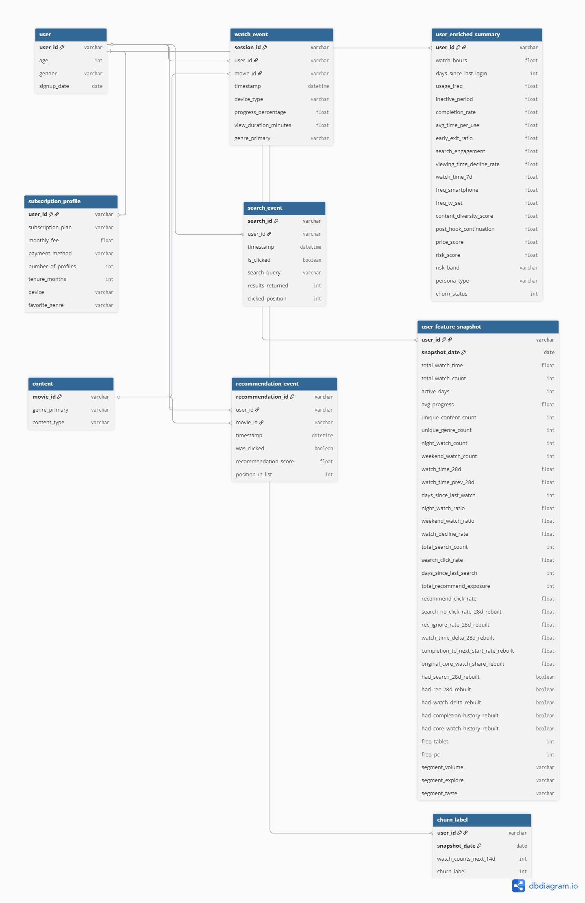

<p align="center">
  
</p>

<h1 align="center">TVING Churn Prediction Retention</h1>

---

## 1. Project Overview

본 프로젝트는 OTT 서비스 사용자 행동 데이터를 기반으로 **이탈(Churn) 가능성**을 예측하고,  
이탈 위험 유저를 **해석 가능한 기준으로 분류**해 운영 및 마케팅 활용이 가능하도록 정리한 데이터 분석 프로젝트입니다.

본 프로젝트는 원천 사용자 행동 로그를 바탕으로 생성한 합성 분석 데이터셋(`synthetic_*`)을 활용해 churn 예측과 사용자 세그먼트 분석을 수행했습니다.

주요 목표는 다음과 같습니다.

- **churn risk 예측**
- **위험도 구간화** (`risk_band`)
- **사용자 성향 분류** (`persona_type`)
- **SHAP 기반 해석**
- **운영 관점에서 활용 가능한 대시보드 구성**

---

## 2. Team Members & Roles

- **조가영/팀장** : 전체 분석 방향 수립, 데이터 설계 기준 정리, 프로젝트 스토리라인 구성, EDA 및 해석 근거 정리
- **송미영/팀원** : 발표용 시각화 정리 및 PPT 디자인
- **이세미/팀원** : 대시보드 시각화, Figma 설계 및 화면 고도화
- **이재혁/팀원** : 로그 집계, 모델 실행, 성능 및 수치 검증 

---

## 3. Development Environment

본 프로젝트는 **Python 기반 분석 환경**과 **TSX 기반 대시보드 코드 구조**를 중심으로 진행했습니다.

- **Python / Jupyter Notebook** 기반 분석 및 모델링
- **GitHub** 기반 버전 관리 및 산출물 정리
- **CSV 기반 데이터 관리**
- **TSX 컴포넌트 기반 대시보드 코드 구성**

---

## 4. Tech Stack

프로젝트 수행에 사용한 주요 기술은 다음과 같습니다.

- **Language**: Python, TypeScript
- **Data Analysis**: pandas, numpy
- **Modeling**: AutoGluon Tabular
- **Evaluation**: scikit-learn
- **Interpretation**: SHAP
- **Visualization**: matplotlib
- **Dashboard**: Figma + TSX 기반 컴포넌트 구조
- **Version Control**: GitHub

---

## 5. Project Structure

```text
FINAL PROJECT/
├── assets/
├── dashboard/
│   ├── guidelines/
│   ├── src/
│   ├── ATTRIBUTIONS.md
│   ├── index.html
│   ├── package.json
│   ├── postcss.config.mjs
│   ├── vite.config.ts
│   └── README.md
├── data/
│   ├── content_catalog_2025.csv
│   ├── synthetic_churn_final.csv
│   ├── synthetic_recommend_2025.csv
│   ├── synthetic_search_2025.csv
│   └── synthetic_watch_2025.csv
├── docs/
│   ├── 8_데이터구조_변수정의서.xlsx
│   ├── 11_피처엔지니어링_변수정의서.xlsx
│   └── 11_EDA_변수정의서.xlsx
├── notebooks/
│   ├── SHAP_핵심코드.ipynb
│   ├── 모델링_핵심코드.ipynb
│   └── 최종코드.ipynb
├── output/
│   ├── dashboard_main.png
│   ├── final_erd.png
│   ├── shap_bar.png
│   └── shap_beeswarm.png
├── report/
├── image.png
└── README.md
```

## 6. Architecture & Data Pipeline

본 프로젝트의 흐름은 아래와 같습니다.

1. **source data 정리**
2. **churn mart 구성**
3. **weekly snapshot panel 생성**
4. **churn 예측 모델 학습 및 평가**
5. **SHAP 기반 해석**
6. **dashboard output 생성**

즉, 단순 모델링이 아니라  
**데이터 가공 → 패널화 → 예측 → 해석 → 대시보드 활용**까지 이어지는 구조로 설계했습니다.

---

## 7. Analysis Scope and Design

분석 구조는 **7일 단위 snapshot**, **과거 28일 feature**, **미래 14일 label** 기준으로 설계했습니다.

- **Snapshot Cadence:** 7일
- **Feature Window:** 과거 28일
- **Label Window:** 미래 14일

이 구조를 통해 사용자 행동의 최근 흐름을 반영하면서도, 시점 기반 churn 예측에 맞는 형태로 분석 파이프라인을 구성했습니다.

---

## 8. Data Structure
🔗 [데이터 구조 및 테이블 변수정의서](./docs/8_데이터구조_변수정의서.xlsx)

본 프로젝트의 데이터 구조는 **기본 차원 정보 + 사용자 행동 로그 + 파생 마트 및 라벨**로 구성됩니다.

핵심 차원 영역은 사용자, 구독, 콘텐츠 정보를 담고 있고,  
행동 로그 영역은 시청, 검색, 추천 반응과 같은 실제 서비스 이용 이벤트를 기록합니다.  
이후 이를 **summary / snapshot / label** 구조로 가공해 분석과 모델링에 활용했습니다.

특히 `user_enriched_summary`, `user_feature_snapshot`, `churn_label`의 역할을 분리해  
**데이터 누수(Data Leakage)를 방지하고 시계열 예측 구조의 정합성**을 유지했습니다.

---

## 9. ERD

아래 ERD는 프로젝트의 주요 테이블 구조와 관계를 시각적으로 정리한 것입니다.

<p align="center">
  
</p>

- 사용자·구독·콘텐츠 정보와 행동 로그 기반 구조
- 주간 snapshot / feature mart / churn label 생성 반영
- 핵심 테이블: `user_feature_snapshot`, `churn_label`, `user_enriched_summary`
- 예측·해석·세그먼트·대시보드 활용 목적의 데이터 모델

---

## 10. Feature Engineering
🔗 [파생변수 및 피처 엔지니어링 정의서](./docs/10_피처엔지니어링_변수정의서.xlsx)

Feature engineering은 최근 사용자 행동을 설명 가능하게 반영하는 데 초점을 두었습니다.

핵심적으로는 다음 세 축으로 구성됩니다.

- **행동 기반 파생변수** 검색, 추천 반응, 시청 변화, 연속 시청 패턴 반영
- **위험도 산출 구조** 최근성, 시청 감소, 추천 무시, 가격 민감도 등을 종합해 `risk_band` 생성
- **페르소나 분류 구조** 콘텐츠 성향과 가격 민감 성향을 함께 반영해 `persona_type` 정의

---

## 11. Exploratory Data Analysis (EDA)
🔗 [EDA 분석 변수정의서](./docs/11_EDA 분석_변수정의서.xlsx)

EDA는 raw 데이터를 다시 집계하는 방식이 아니라,  
**최종 churn mart 기준의 user-level 분석**에 초점을 두고 수행했습니다.

주요 분석 축은 다음과 같습니다.

- **활동량**
- **최근성**
- **몰입도**
- **탐색 행동**
- **추천 반응**
- **콘텐츠 소비 패턴**
- **기기 사용 패턴**
- **행동 변화**

---

## 12. Modeling
🔗 [모델링 핵심 코드](./notebooks/모델링_핵심코드.ipynb)

모델링은 **weekly snapshot panel**을 기반으로 churn을 예측하는 구조입니다.  
즉, snapshot 시점 직전 28일 feature와 이후 14일 label을 결합해  
주간 단위로 churn risk를 추정했습니다.

핵심 흐름은 다음과 같습니다.

1. snapshot 생성
2. feature 구성
3. label 생성
4. 학습/검증 분리
5. 모델 학습
6. 성능 평가
7. 대시보드용 결과 저장

---

## 13. SHAP-based Interpretation
🔗 [SHAP 핵심 코드](./notebooks/SHAP_핵심코드.ipynb)

SHAP은 모델 결과를 **설명 가능하게 해석**하기 위해 사용했습니다.

### SHAP Results

Global SHAP 결과에서는 어떤 변수가 churn 예측에 크게 기여하는지 확인할 수 있고,  
beeswarm 시각화를 통해 각 변수의 영향 분포와 방향성을 함께 살펴볼 수 있습니다.

🔗 [SHAP Bar](./output/shap_bar.png)  
🔗 [SHAP beeswarm](./output/shap_beeswarm.png)

---

## 14. Dashboard

🔗 [Live Dashboard](https://www.figma.com/make/JzShHp6hijGdX9nrRTUJxb/TVING-%EB%8D%B0%EC%9D%B4%ED%84%B0-%EB%B6%84%EC%84%9D-%EB%8C%80%EC%8B%9C%EB%B3%B4%EB%93%9C--%EC%B5%9C%EC%A2%85-?p=f&t=L3C5YRPLhnlHnmFn-0)


대시보드는 분석 결과를 운영 관점에서 바로 볼 수 있도록 구성했습니다.

주요 확인 항목은 다음과 같습니다.

- **churn risk distribution**
- **주요 이탈 원인**
- **churn trend**
- **intervention queue**
- **KPI row**
- **분석 파이프라인 흐름**

---

## 15. Conclusion

- **결론 1** : 접속 빈도와 최근 행동 변화는 churn 예측의 핵심 신호였습니다.
- **결론 2** : 7일 Snapshot / 28일 Feature / 14일 Label 구조로 안정적인 예측 체계를 구축했습니다.
- **결론 3** : 위험도, 페르소나, SHAP 해석을 결합해 운영 활용 가능한 결과로 정리했습니다.